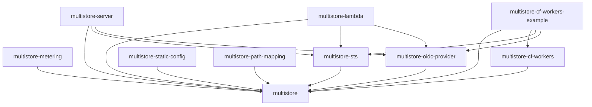

# Crate Layout

The project is organized as a Cargo workspace with libraries (traits and logic) and example runtimes (executable targets).

```
crates/
├── core/          (multistore)                # Runtime-agnostic: traits, S3 parsing, SigV4, registries
├── metering/      (multistore-metering)       # Usage metering and quota enforcement middleware
├── sts/           (multistore-sts)            # OIDC/STS token exchange (AssumeRoleWithWebIdentity)
├── oidc-provider/ (multistore-oidc-provider)  # Outbound OIDC provider (JWT signing, JWKS, exchange)
├── static-config/ (multistore-static-config)  # Static config provider (buckets/roles/credentials)
├── path-mapping/  (multistore-path-mapping)   # Hierarchical path-based backend resolution
└── cf-workers/    (multistore-cf-workers)     # Cloudflare Workers runtime library (WASM)

examples/
├── server/     (multistore-server)             # Tokio/Hyper for container deployments
├── lambda/     (multistore-lambda)             # AWS Lambda runtime
└── cf-workers/ (multistore-cf-workers-example) # Cloudflare Workers example for edge deployments
```

## Crate Responsibilities

### `multistore`

The runtime-agnostic core. Contains:
- `ProxyGateway` — Router-based dispatch + S3 parsing + identity resolution + two-phase request dispatch (`handle_request()` → `GatewayResponse`)
- `Router` — Path-based route matching via `matchit` for efficient pre-dispatch
- `RouteHandler` trait — Pluggable request interception
- `Middleware` trait — Composable post-auth middleware for dispatch, with `after_dispatch` for post-response observation
- `BucketRegistry` trait — Bucket lookup, authorization, and listing
- `CredentialRegistry` trait — Credential and role storage
- `ProxyBackend` trait — Runtime abstraction for store/signer/raw HTTP; its `forward()` method provides backend HTTP transport, and the core orchestrates the call so middleware can observe response metadata
- S3 request parsing, XML response building, list prefix rewriting
- SigV4 signature verification
- Sealed session token encryption/decryption
- Type definitions (`BucketConfig`, `RoleConfig`, `AccessScope`, `TemporaryCredentials`, `BackendCredentials`, etc.) — including `BackendCredentials`, the backend credential value type the outbound exchange produces and injects into a `BucketConfig`

**Feature flags:**
- `azure` — Azure Blob Storage support
- `gcp` — Google Cloud Storage support

### `multistore-metering`

Usage metering and quota enforcement middleware:
- `MeteringMiddleware<Q, U>` — Pre-dispatch quota checking + post-dispatch usage recording via the `Middleware` trait
- `QuotaChecker` trait — Pre-dispatch quota enforcement; return `Err(QuotaExceeded)` to reject with HTTP 429
- `UsageRecorder` trait — Post-dispatch operation recording for usage tracking
- `UsageEvent` — Operation metadata passed to the recorder (identity, operation, bytes, status)
- `NoopQuotaChecker` / `NoopRecorder` — Convenience no-op implementations for when only one side is needed

### `multistore-sts`

OIDC token exchange implementing `AssumeRoleWithWebIdentity`:
- `StsRouterExt` — registers a closure that intercepts STS requests on the `Router`
- JWT decoding and validation (RS256)
- JWKS fetching and caching
- Trust policy evaluation (issuer, audience, subject conditions)
- Temporary credential minting with scope template variables

### `multistore-oidc-provider`

Outbound OIDC identity provider for backend authentication:
- `OidcRouterExt` — registers closures for `.well-known` discovery endpoints on the `Router`
- RSA JWT signing (`JwtSigner`)
- JWKS endpoint serving
- OpenID Connect discovery document
- AWS STS credential exchange — the `AssumeRoleWithWebIdentity` request build + XML parse, plus the `AwsBackendAuth` middleware that drives it
- Credential caching

### `multistore-static-config`

The built-in configuration provider (`StaticProvider`) — the only config provider shipped today:
- Loads buckets, roles, and credentials from a single TOML or JSON file
- Implements `BucketRegistry` and `CredentialRegistry` over the parsed config
- Suitable for static deployments where the bucket/role/credential set is known ahead of time

### `multistore-path-mapping`

Hierarchical path-based backend resolution:
- Maps request paths of the form `/{account}/{product}/{key}` to a per-(account, product) backend
- Resolves the backend for each account/product pair from the configured mapping

### `multistore-server`

The native server runtime (in `examples/server/`):
- Tokio/Hyper HTTP server
- `ServerBackend` implementing `ProxyBackend` with reqwest
- Streaming via hyper `Incoming` bodies and reqwest `bytes_stream()`
- Wires `ProxyGateway` with a `Router` (OIDC discovery + STS routes)
- CLI argument parsing (`--config`, `--listen`, `--domain`, `--sts-config`)

### `multistore-cf-workers`

The reusable Cloudflare Workers WASM runtime library (in `crates/cf-workers/`):
- `WorkerBackend` implementing `ProxyBackend` with `web_sys::fetch`
- `RequestParts` — extracts owned HTTP metadata from `web_sys::Request` and provides `as_request_info()` for gateway dispatch (exposes both the decoded `path` for routing and the raw encoded `signing_path` for SigV4, wiring the latter into the signing path automatically)
- `GatewayResponseExt` — extension trait for converting `GatewayResponse` to `web_sys::Response` via `.into_web_sys()`
- `JsBody` — zero-copy body wrapper around `web_sys::ReadableStream`
- `WsHeaders` — newtype around `web_sys::Headers` with `From<&HeaderMap>` (works around orphan rules)
- `FetchConnector` bridging `object_store` HTTP to Workers Fetch API

> [!WARNING]
> This crate is excluded from the workspace `default-members` because WASM types are `!Send` and won't compile on native targets. Always build with `--target wasm32-unknown-unknown`.

### `multistore-cf-workers-example`

The Cloudflare Workers example deployment (in `examples/cf-workers/`). It wires the
`multistore-cf-workers` library together with config, STS, OIDC, and metering, and adds
example-only symbols:
- `BandwidthMeter` Durable Object — per-(bucket, identity) sliding-window byte counter
- `DoBandwidthMeter` implementing `QuotaChecker` + `UsageRecorder` via the `BandwidthMeter` DO
- `CfRateLimiter` middleware for request-rate limiting via CF Rate Limiting API
- Config loading from env vars (`PROXY_CONFIG`, `BANDWIDTH_QUOTAS`)

## Dependency Flow



Libraries define trait abstractions. Runtimes implement `ProxyBackend` with platform-native primitives, build a `Router` with extension traits, and convert the two-variant `GatewayResponse` into a platform response (e.g. via `GatewayResponseExt::into_web_sys()` on Workers).
