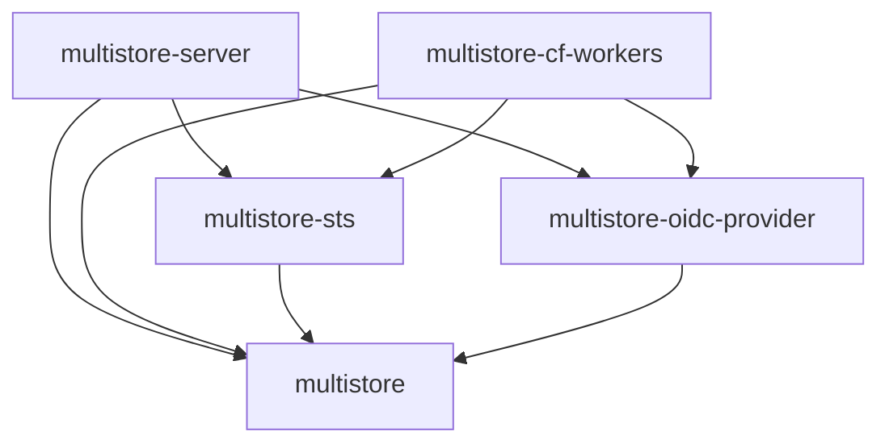

# Crate Layout

The project is organized as a Cargo workspace with libraries (traits and logic) and example runtimes (executable targets).

```
crates/
├── core/  (multistore)                 # Runtime-agnostic: traits, S3 parsing, SigV4, registries
├── sts/   (multistore-sts)             # OIDC/STS token exchange (AssumeRoleWithWebIdentity)
└── oidc-provider/                      # Outbound OIDC provider (JWT signing, JWKS, exchange)

examples/
├── server/ (multistore-server)         # Tokio/Hyper for container deployments
└── cf-workers/ (multistore-cf-workers) # Cloudflare Workers for edge deployments
```

## Crate Responsibilities

### `multistore`

The runtime-agnostic core. Contains:
- `ProxyGateway` — Router-based dispatch + S3 parsing + identity resolution + two-phase request dispatch (`handle_request()` → `GatewayResponse`)
- `Router` — Path-based route matching via `matchit` for efficient pre-dispatch
- `RouteHandler` trait — Pluggable request interception
- `BucketRegistry` trait — Bucket lookup, authorization, and listing
- `CredentialRegistry` trait — Credential and role storage
- `ProxyBackend` trait — Runtime abstraction for store/signer/raw HTTP
- S3 request parsing, XML response building, list prefix rewriting
- SigV4 signature verification
- Sealed session token encryption/decryption
- Type definitions (`BucketConfig`, `RoleConfig`, `AccessScope`, etc.)

**Feature flags:**
- `azure` — Azure Blob Storage support
- `gcp` — Google Cloud Storage support

### `multistore-sts`

OIDC token exchange implementing `AssumeRoleWithWebIdentity`:
- `StsRouterExt` — registers a closure that intercepts STS requests on the `Router`
- JWT decoding and validation (RS256)
- JWKS fetching and caching
- Trust policy evaluation (issuer, audience, subject conditions)
- Temporary credential minting with scope template variables

### `multistore-oidc-provider`

Outbound OIDC identity provider for backend authentication:
- `OidcRouterExt` — registers closures for `.well-known` discovery endpoints on the `Router`
- RSA JWT signing (`JwtSigner`)
- JWKS endpoint serving
- OpenID Connect discovery document
- AWS credential exchange (`AwsBackendAuth` middleware)
- Credential caching

### `multistore-server`

The native server runtime (in `examples/server/`):
- Tokio/Hyper HTTP server
- `ServerBackend` implementing `ProxyBackend` with reqwest
- Streaming via hyper `Incoming` bodies and reqwest `bytes_stream()`
- Wires `ProxyGateway` with a `Router` (OIDC discovery + STS routes)
- CLI argument parsing (`--config`, `--listen`, `--domain`, `--sts-config`)

### `multistore-cf-workers`

The Cloudflare Workers WASM runtime (in `examples/cf-workers/`):
- `WorkerBackend` implementing `ProxyBackend` with `web_sys::fetch`
- `FetchConnector` bridging `object_store` HTTP to Workers Fetch API
- JS `ReadableStream` passthrough for zero-copy streaming
- Config loading from env vars (`PROXY_CONFIG`)

> [!WARNING]
> This crate is excluded from the workspace `default-members` because WASM types are `!Send` and won't compile on native targets. Always build with `--target wasm32-unknown-unknown`.

## Dependency Flow



Libraries define trait abstractions. Runtimes implement `ProxyBackend` with platform-native primitives, build a `Router` with extension traits, and handle the two-variant `GatewayResponse`.
