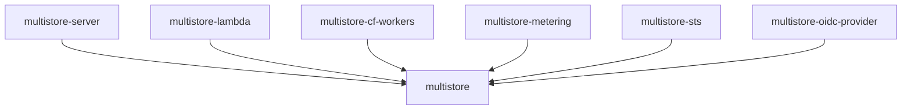

# Crate Layout

The project is organized as a Cargo workspace with libraries (traits and logic) and example runtimes (executable targets).

```
crates/
├── core/  (multistore)                 # Runtime-agnostic: s3s service, registries, authorization
├── metering/ (multistore-metering)     # Usage metering and quota enforcement traits
├── sts/   (multistore-sts)             # OIDC/STS token exchange (AssumeRoleWithWebIdentity)
└── oidc-provider/                      # Outbound OIDC provider (JWT signing, JWKS, exchange)

examples/
├── server/ (multistore-server)         # Tokio/Hyper for container deployments
├── lambda/ (multistore-lambda)         # AWS Lambda runtime
└── cf-workers/ (multistore-cf-workers) # Cloudflare Workers for edge deployments
```

## Crate Responsibilities

### `multistore`

The runtime-agnostic core. Contains:
- `MultistoreService` — s3s-based S3 service implementation mapping S3 operations to `object_store` calls (GET/HEAD/PUT/DELETE/LIST/multipart)
- `MultistoreAuth` — s3s auth adapter wrapping `CredentialRegistry` for SigV4 verification
- `StoreFactory` trait — Runtime-provided factory for creating `ObjectStore`, `PaginatedListStore`, and `MultipartStore` per request
- `BucketRegistry` trait — Bucket lookup, authorization, and listing
- `CredentialRegistry` trait — Credential and role storage
- `TemporaryCredentialResolver` trait — Resolve session tokens into temporary credentials
- `authorize()` — Check if an identity is authorized for an S3 operation
- `StoreBuilder` — Provider-specific `object_store` builder (S3, Azure, GCS)
- List prefix rewriting
- Type definitions (`BucketConfig`, `RoleConfig`, `AccessScope`, etc.)

**Feature flags:**
- `azure` — Azure Blob Storage support
- `gcp` — Google Cloud Storage support

### `multistore-metering`

Usage metering and quota enforcement trait abstractions:
- `QuotaChecker` trait — Pre-dispatch quota enforcement; return `Err(QuotaExceeded)` to reject with HTTP 429
- `UsageRecorder` trait — Post-dispatch operation recording for usage tracking
- `UsageEvent` — Operation metadata passed to the recorder (identity, operation, bytes, status)
- `NoopQuotaChecker` / `NoopRecorder` — Convenience no-op implementations

### `multistore-sts`

OIDC token exchange implementing `AssumeRoleWithWebIdentity`:
- JWT decoding and validation (RS256)
- JWKS fetching and caching
- Trust policy evaluation (issuer, audience, subject conditions)
- Temporary credential minting with scope template variables
- `TokenKey` — sealed session token encryption/decryption (implements `TemporaryCredentialResolver`)

### `multistore-oidc-provider`

Outbound OIDC identity provider for backend authentication:
- RSA JWT signing (`JwtSigner`)
- JWKS endpoint serving
- OpenID Connect discovery document
- AWS credential exchange (`AwsBackendAuth`)
- Credential caching

### `multistore-server`

The native server runtime (in `examples/server/`):
- Tokio/Hyper HTTP server via `S3ServiceBuilder` + hyper-util
- `ServerBackend` implementing `StoreFactory` with reqwest
- CLI argument parsing (`--config`, `--listen`, `--domain`)

### `multistore-lambda`

The AWS Lambda runtime (in `examples/lambda/`):
- Lambda HTTP adapter converting between `lambda_http` and s3s types
- `LambdaBackend` implementing `StoreFactory` with default `object_store` HTTP

### `multistore-cf-workers`

The Cloudflare Workers WASM runtime (in `examples/cf-workers/`):
- `WorkerBackend` implementing `StoreFactory` with `web_sys::fetch`
- `FetchConnector` bridging `object_store` HTTP to Workers Fetch API
- `BandwidthMeter` Durable Object — per-(bucket, identity) sliding-window byte counter
- Config loading from env vars (`PROXY_CONFIG`, `VIRTUAL_HOST_DOMAIN`)

> [!WARNING]
> This crate is excluded from the workspace `default-members` because WASM types are `!Send` and won't compile on native targets. Always build with `--target wasm32-unknown-unknown`.

## Dependency Flow



Libraries define trait abstractions. Runtimes implement `StoreFactory` with platform-native primitives. The s3s-based `MultistoreService` handles S3 protocol dispatch via the `s3s::S3` trait, using `object_store` for all backend operations including multipart uploads across S3, Azure, and GCS.
