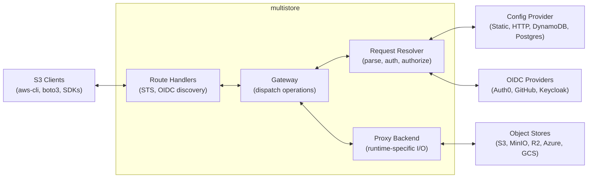

# Architecture Overview

Multistore is an S3-compliant gateway that sits between clients and backend object stores. It provides authentication, authorization, and transparent proxying with zero-copy streaming.

## High-Level Architecture

## Design Principles

**Runtime-agnostic core** — The core proxy logic (`multistore`) has zero runtime dependencies. No Tokio, no `worker-rs`. It compiles to both native and WASM targets.

**Route handler chain** — Pluggable `RouteHandler` implementations intercept requests before the main proxy pipeline. STS and OIDC discovery are registered as route handlers, keeping protocol-specific logic out of runtimes.

**Two-phase dispatch** — The `Gateway` separates request resolution from execution. `resolve_request()` determines what to do; the runtime executes it. This keeps streaming logic in runtime-specific code where it belongs.

**Presigned URLs for streaming** — GET, HEAD, PUT, and DELETE operations use presigned URLs. The runtime forwards the request directly to the backend — no buffering, no double-handling of bodies.

**Pluggable traits** — Four trait boundaries enable customization:
- `RouteHandler` — Pre-dispatch request interception (STS, OIDC discovery, custom endpoints)
- `RequestResolver` — How requests are parsed, authenticated, and authorized
- `ConfigProvider` — Where configuration comes from
- `ProxyBackend` — How the runtime interacts with backends

## Key Components

| Component | Crate | Responsibility |
|-----------|-------|---------------|
| [Gateway](./request-lifecycle) | `multistore` | Route handler chain + two-phase dispatch (presigned URLs, LIST, multipart) |
| [Request Resolver](./request-lifecycle#request-resolution) | `multistore` | Parse S3 requests, authenticate, authorize |
| [Config Providers](/configuration/providers/) | `multistore` | Load buckets, roles, credentials |
| [STS Route Handler](/auth/proxy-auth#oidcsts-temporary-credentials) | `multistore-sts` | OIDC token exchange, credential minting |
| [OIDC Provider](/auth/backend-auth#oidc-backend-auth) | `multistore-oidc-provider` | Self-signed JWT minting, OIDC discovery, backend credential exchange |
| [Server Runtime](./multi-runtime#server-runtime) | `multistore-server` | Tokio/Hyper HTTP server |
| [Workers Runtime](./multi-runtime#cloudflare-workers-runtime) | `multistore-cf-workers` | WASM-based Cloudflare Workers |

## Further Reading

- [Crate Layout](./crate-layout) — How the workspace is organized
- [Request Lifecycle](./request-lifecycle) — How a request flows through the proxy
- [Multi-Runtime Design](./multi-runtime) — How the same core runs on native and WASM
