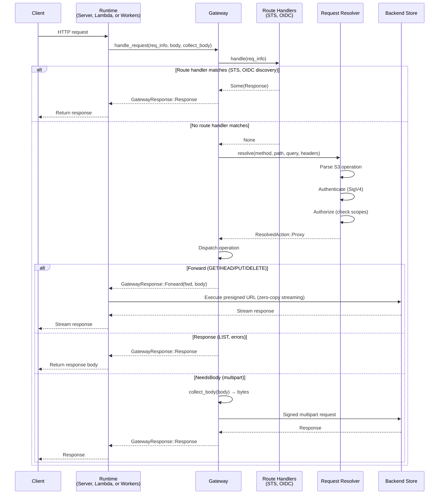

# Request Lifecycle

Every request flows through the `Gateway`: first through registered route handlers (STS, OIDC discovery), then into the two-phase proxy dispatch (resolve, then execute). The recommended entry point is `Gateway::handle_request`, which returns a two-variant `GatewayResponse` for simple runtime integration.

## Overview



## Route Handlers

Before the proxy dispatch pipeline runs, registered `RouteHandler` implementations are checked in order. Each handler inspects the `RequestInfo` (method, path, query, headers) and either returns a response or passes through.

Built-in route handlers:
- **`OidcDiscoveryRouteHandler`** (`multistore-oidc-provider`) — Serves `/.well-known/openid-configuration` and `/.well-known/jwks.json`
- **`StsRouteHandler`** (`multistore-sts`) — Intercepts `AssumeRoleWithWebIdentity` STS requests

Handlers are registered via builder methods on the `Gateway`:

```rust
let gateway = Gateway::new(backend, resolver)
    .with_oidc_auth(oidc_auth)
    .with_route_handler(oidc_discovery)
    .with_route_handler(StsRouteHandler::new(sts_config, jwks_cache, token_key));
```

## Phase 1: Request Resolution

The `RequestResolver` determines what to do with an incoming request. The `DefaultResolver` handles standard S3 proxy behavior:

1. **Parse the S3 operation** from the HTTP method, path, query, and headers
   - Path-style: `GET /bucket/key` → GetObject on `bucket` with key `key`
   - Virtual-hosted: `GET /key` with `Host: bucket.s3.example.com` → same operation
2. **Authenticate** the request by verifying the SigV4 signature against stored or sealed credentials
3. **Authorize** by checking the caller's access scopes against the requested bucket, key prefix, and operation
4. **Return** a `ResolvedAction`:
   - `Proxy { operation, bucket_config, list_rewrite }` — forward to a backend
   - `Response { status, headers, body }` — return a synthetic response (e.g., `ListBuckets`)

Custom resolvers can implement entirely different routing, authentication, and namespace mapping.

## Phase 2: Proxy Dispatch

The `Gateway` takes the resolved action and dispatches it based on the S3 operation type. When using `handle_request`, the three internal action types are collapsed into a two-variant `GatewayResponse`:

### `Forward(ForwardRequest)`

Used for: **GET, HEAD, PUT, DELETE**

The handler generates a presigned URL using the backend's `Signer` and returns it to the runtime with filtered headers. The runtime executes the presigned URL with its native HTTP client, streaming request and response bodies directly. The handler never touches the body data.

- Presigned URL TTL: 300 seconds
- Headers forwarded: `range`, `if-match`, `if-none-match`, `if-modified-since`, `if-unmodified-since`, `content-type`, `content-length`, `content-md5`, `content-encoding`, `content-disposition`, `cache-control`, `x-amz-content-sha256`

### `Response(ProxyResult)`

Used for: **LIST, errors, synthetic responses**

For LIST operations, the handler calls `list_paginated()` via the backend's `PaginatedListStore`, builds S3 `ListObjectsV2` XML from the results, and returns it as a complete response. If a `ListRewrite` is configured, key prefixes are transformed in the XML.

LIST supports backend-side pagination via `max-keys`, `continuation-token`, and `start-after` query parameters, fetching only one page per request.

### `NeedsBody(PendingRequest)` (internal)

Used for: **CreateMultipartUpload, UploadPart, CompleteMultipartUpload, AbortMultipartUpload**

Multipart operations need the request body (e.g., the XML body for `CompleteMultipartUpload`). When using `handle_request`, this is resolved internally — the gateway calls the `collect_body` closure provided by the runtime and returns the result as `GatewayResponse::Response`. Runtimes never see this variant.

For lower-level control, `Gateway::handle` returns the raw three-variant `HandlerAction`, and runtimes call `handle_with_body()` themselves.

> [!WARNING]
> Multipart uploads are only supported for `backend_type = "s3"`. Non-S3 backends should use single PUT requests (object_store handles chunking internally).

## Response Header Forwarding

The proxy forwards only specific headers from the backend response to the client:

`content-type`, `content-length`, `content-range`, `etag`, `last-modified`, `accept-ranges`, `content-encoding`, `content-disposition`, `cache-control`, `x-amz-request-id`, `x-amz-version-id`, `location`

All other backend headers are filtered out.
