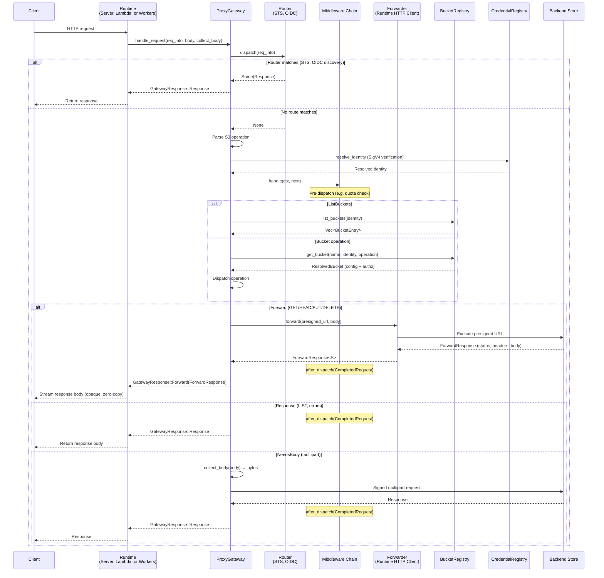

# Request Lifecycle

Every request flows through the `ProxyGateway`: first through the `Router` (which maps paths to handlers for STS, OIDC discovery, etc.), then into the proxy dispatch pipeline (middleware chain → backend dispatch → post-dispatch callbacks). The recommended entry point is `ProxyGateway::handle_request`, which returns a two-variant `GatewayResponse` for simple runtime integration.

## Overview



## Router

Before the proxy dispatch pipeline runs, the `Router` matches the request path against registered routes using `matchit`. Exact paths take priority over catch-all patterns, so OIDC discovery endpoints (`/.well-known/*`) are matched before the STS catch-all (`/{*path}`).

When a route matches, the router extracts path parameters from the pattern and populates `RequestInfo::params`. Handlers access parameters by name via `params.get("name")`.

Built-in route handlers:

- **`OidcRouterExt`** (`multistore-oidc-provider`) — Registers handlers for `/.well-known/openid-configuration` and `/.well-known/jwks.json`
- **`StsRouterExt`** (`multistore-sts`) — Registers a handler that intercepts `AssumeRoleWithWebIdentity` STS requests

### Method routing

Handlers implement the `RouteHandler` trait and override individual HTTP method handlers (`get`, `post`, `put`, `delete`, `head`) for method-specific behavior, or override `handle` directly for method-agnostic handlers:

```rust
use multistore::router::Router;

struct HealthCheck;

impl RouteHandler for HealthCheck {
    fn get<'a>(&'a self, _req: &'a RequestInfo<'a>) -> RouteHandlerFuture<'a> {
        Box::pin(async { Some(ProxyResult::json(200, r#"{"ok":true}"#)) })
    }
}

let router = Router::new()
    .route("/api/health", HealthCheck);
```

### Extension traits

Extension crates provide `Router` extension traits for one-call registration:

```rust
use multistore::router::Router;
use multistore_oidc_provider::route_handler::OidcRouterExt;
use multistore_sts::route_handler::StsRouterExt;

let router = Router::new()
    .with_oidc_discovery(issuer, signer)
    .with_sts(sts_creds, jwks_cache, token_key);

let gateway = ProxyGateway::new(backend, bucket_registry, cred_registry, domain)
    .with_credential_resolver(token_key)
    .with_middleware(oidc_auth)
    .with_router(router);
```

## Phase 1: Request Resolution

The `ProxyGateway` owns S3 request parsing, identity resolution, and bucket authorization:

1. **Parse the S3 operation** from the HTTP method, path, query, and headers
   - Path-style: `GET /bucket/key` → GetObject on `bucket` with key `key`
   - Virtual-hosted: `GET /key` with `Host: bucket.s3.example.com` → same operation
2. **Resolve identity** via the `CredentialRegistry` — verifies SigV4 signatures against stored or sealed credentials
3. **Resolve bucket** via the `BucketRegistry` — looks up the bucket config and authorizes the caller
4. **Dispatch** the operation based on type (forward, list, or multipart)

Custom `BucketRegistry` implementations can provide entirely different authorization logic, namespace mapping, or dynamic bucket configuration.

## Phase 2: Proxy Dispatch

The gateway takes the resolved bucket config and dispatches it based on the S3 operation type. When using `handle_request`, the three internal action types are collapsed into a two-variant `GatewayResponse`:

### `Forward(ForwardResponse<S>)`

Used for: **GET, HEAD, PUT, DELETE**

The handler generates a presigned URL using the backend's `Signer`, then the core calls the runtime-provided `Forwarder` to execute the HTTP request. The `Forwarder` returns a `ForwardResponse<S>` with the backend's status, headers, content length, and an opaque streaming body. The core observes the response metadata (status, content length) and fires `after_dispatch` callbacks on all middleware before returning the response to the runtime. The response body type `S` is an associated type on the `Forwarder` — on CF Workers it's a `web_sys::Response` (zero-copy), on native runtimes it's a `reqwest::Response` or similar.

- Presigned URL TTL: 300 seconds
- Headers forwarded: `range`, `if-match`, `if-none-match`, `if-modified-since`, `if-unmodified-since`, `content-type`, `content-length`, `content-md5`, `content-encoding`, `content-disposition`, `cache-control`, `x-amz-content-sha256`

### `Response(ProxyResult)`

Used for: **LIST, errors, synthetic responses**

For LIST operations, the handler calls `list_paginated()` via the backend's `PaginatedListStore`, builds S3 XML from the results, and returns it as a complete response. Both ListObjectsV1 and ListObjectsV2 are supported — the proxy detects the version from the `list-type` query parameter and produces the appropriate XML format. If a `ListRewrite` is configured, key prefixes are transformed in the XML.

LIST supports backend-side pagination. V2 uses `continuation-token` and `start-after`; V1 uses `marker`. Both versions support `max-keys`, fetching only one page per request.

### `NeedsBody(PendingRequest)` (internal)

Used for: **CreateMultipartUpload, UploadPart, CompleteMultipartUpload, AbortMultipartUpload**

Multipart operations need the request body (e.g., the XML body for `CompleteMultipartUpload`). When using `handle_request`, this is resolved internally — the gateway calls the `collect_body` closure provided by the runtime and returns the result as `GatewayResponse::Response`. Runtimes never see this variant.

For lower-level control, `ProxyGateway::handle` returns the raw three-variant `HandlerAction`, and runtimes call `handle_with_body()` themselves.

> [!WARNING]
> Multipart uploads are only supported for `backend_type = "s3"`. Non-S3 backends should use single PUT requests (object_store handles chunking internally).

## Response Header Filtering

The proxy uses a denylist to strip dangerous headers from backend responses before forwarding to clients. All headers pass through except:

- **Hop-by-hop** (RFC 7230 §6.1): `transfer-encoding`, `connection`, `keep-alive`, `te`, `trailer`, `upgrade`, `proxy-connection`
- **Auth/cookies**: `proxy-authenticate`, `proxy-authorization`, `www-authenticate`, `set-cookie`
- **Proxy routing**: `forwarded`, `x-forwarded-for`, `x-forwarded-proto`, `x-forwarded-host`, `x-forwarded-port`, `via`
- **Encryption key material**: `x-amz-server-side-encryption-customer-key-md5`, `x-amz-server-side-encryption-aws-kms-key-id`, `x-ms-encryption-key-sha256`, `x-goog-encryption-key-sha256`

This means content headers, cloud provider metadata (e.g. `x-amz-storage-class`), and user metadata from any provider (`x-amz-meta-*`, `x-ms-meta-*`, `x-goog-meta-*`) all flow through to clients automatically.
