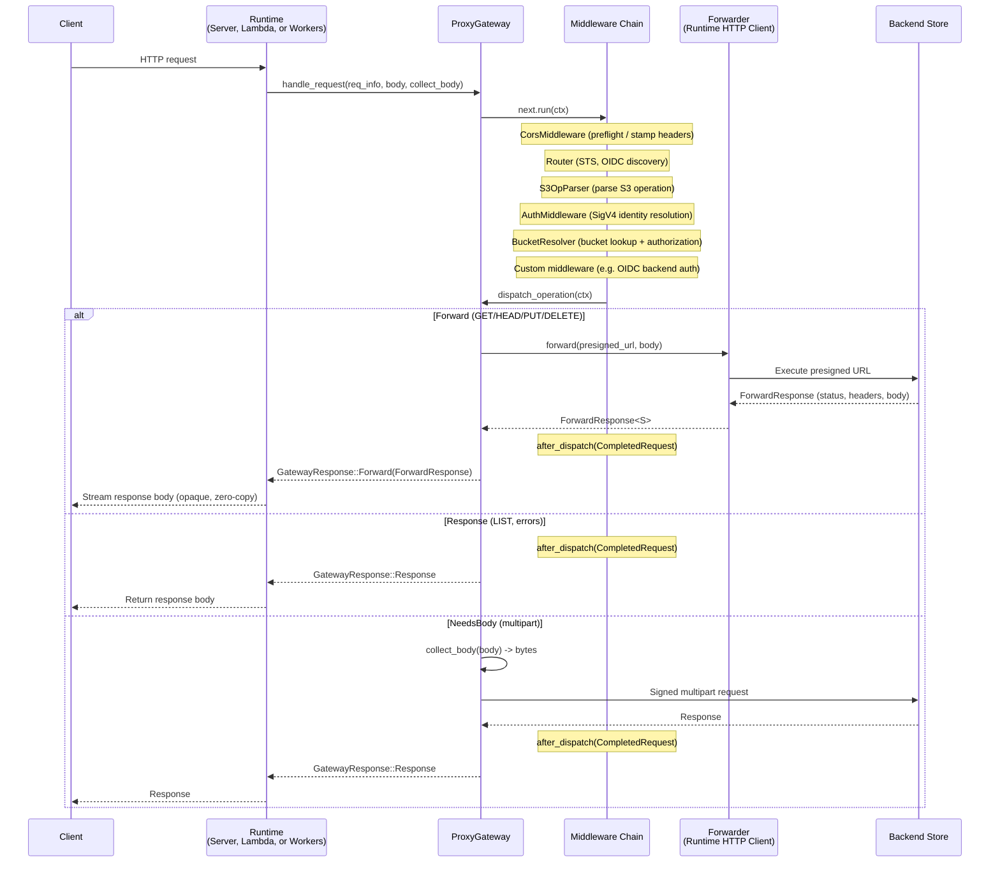

# Request Lifecycle

Every request flows through the `ProxyGateway`'s unified middleware chain, then into backend dispatch. The middleware chain handles routing, CORS, S3 request parsing, authentication, and bucket resolution -- all as composable middleware registered in order. The recommended entry point is `ProxyGateway::handle_request`, which returns a two-variant `GatewayResponse` for simple runtime integration.

## Overview



## Middleware Chain

All request processing flows through a unified middleware chain. Middleware executes in registration order, and each middleware can enrich the `RequestContext`, short-circuit with an early response, or delegate to the next middleware via `Next::run`.

### Built-in S3 middleware

The standard S3 middleware stack is registered via `ProxyGateway::with_s3_defaults()`:

1. **`S3OpParser`** -- parses the HTTP request into a typed `S3Operation` and determines host style (path vs virtual-hosted)
2. **`AuthMiddleware`** -- resolves caller identity from SigV4 headers via the `CredentialRegistry`
3. **`BucketResolver`** -- looks up bucket configuration via the `BucketRegistry` and authorizes the caller

Each middleware inserts typed data into `RequestContext::extensions` for downstream middleware and the dispatch function to consume.

### CORS middleware

`CorsMiddleware` handles per-bucket CORS. Place it **before** the S3 defaults so preflight `OPTIONS` requests succeed without credentials. See [CORS configuration](/configuration/cors) for details.

### Router middleware

The `Router` implements `Middleware` and matches request paths against registered routes using `matchit`. When a route matches, the corresponding handler runs and may return an early response (for STS, OIDC discovery, health checks, etc.). When no route matches, the request continues down the middleware chain.

```rust
use multistore::router::Router;
use multistore_oidc_provider::route_handler::OidcRouterExt;
use multistore_sts::route_handler::StsRouterExt;

let router = Router::new()
    .with_oidc_discovery(issuer, signer)
    .with_sts(sts_creds, jwks_cache, token_key);

let gateway = ProxyGateway::new(backend, forwarder, domain.clone())
    .with_middleware(CorsMiddleware::new(config.clone(), domain))
    .with_middleware(router)
    .with_s3_defaults(config.clone(), config);
```

### Custom middleware

Any type implementing `Middleware` can be registered via `with_middleware`. Examples include rate limiters, OIDC backend credential resolution, and metering.

## Dispatch

After the middleware chain completes, the terminal dispatch function reads from `RequestContext::extensions` to determine the action. The three internal action types are collapsed into a two-variant `GatewayResponse` when using `handle_request`:

### `Forward(ForwardResponse<S>)`

Used for: **GET, HEAD, PUT, DELETE**

The handler generates a presigned URL using the backend's `Signer`, then the core calls the runtime-provided `Forwarder` to execute the HTTP request. The `Forwarder` returns a `ForwardResponse<S>` with the backend's status, headers, content length, and an opaque streaming body. The core observes the response metadata (status, content length) and fires `after_dispatch` callbacks on all middleware before returning the response to the runtime. The response body type `S` is an associated type on the `Forwarder` — on CF Workers it's a `web_sys::Response` (zero-copy), on native runtimes it's a `reqwest::Response` or similar.

- Presigned URL TTL: 300 seconds
- Headers forwarded: `range`, `if-match`, `if-none-match`, `if-modified-since`, `if-unmodified-since`, `content-type`, `content-length`, `content-md5`, `content-encoding`, `content-disposition`, `cache-control`, `x-amz-content-sha256`

### `Response(ProxyResult)`

Used for: **LIST, errors, synthetic responses**

For LIST operations, the handler calls `list_paginated()` via the backend's `PaginatedListStore`, builds S3 `ListObjectsV2` XML from the results, and returns it as a complete response. If a `ListRewrite` is configured, key prefixes are transformed in the XML.

LIST supports backend-side pagination via `max-keys`, `continuation-token`, and `start-after` query parameters, fetching only one page per request.

### `NeedsBody(PendingRequest)` (internal)

Used for: **CreateMultipartUpload, UploadPart, CompleteMultipartUpload, AbortMultipartUpload**

Multipart operations need the request body (e.g., the XML body for `CompleteMultipartUpload`). When using `handle_request`, this is resolved internally — the gateway calls the `collect_body` closure provided by the runtime and returns the result as `GatewayResponse::Response`. Runtimes never see this variant.

For lower-level control, `ProxyGateway::handle` returns the raw three-variant `HandlerAction`, and runtimes call `handle_with_body()` themselves.

> [!WARNING]
> Multipart uploads are only supported for `backend_type = "s3"`. Non-S3 backends should use single PUT requests (object_store handles chunking internally).

## Response Header Forwarding

The proxy forwards only specific headers from the backend response to the client:

`content-type`, `content-length`, `content-range`, `etag`, `last-modified`, `accept-ranges`, `content-encoding`, `content-disposition`, `cache-control`, `x-amz-request-id`, `x-amz-version-id`, `location`

All other backend headers are filtered out.
