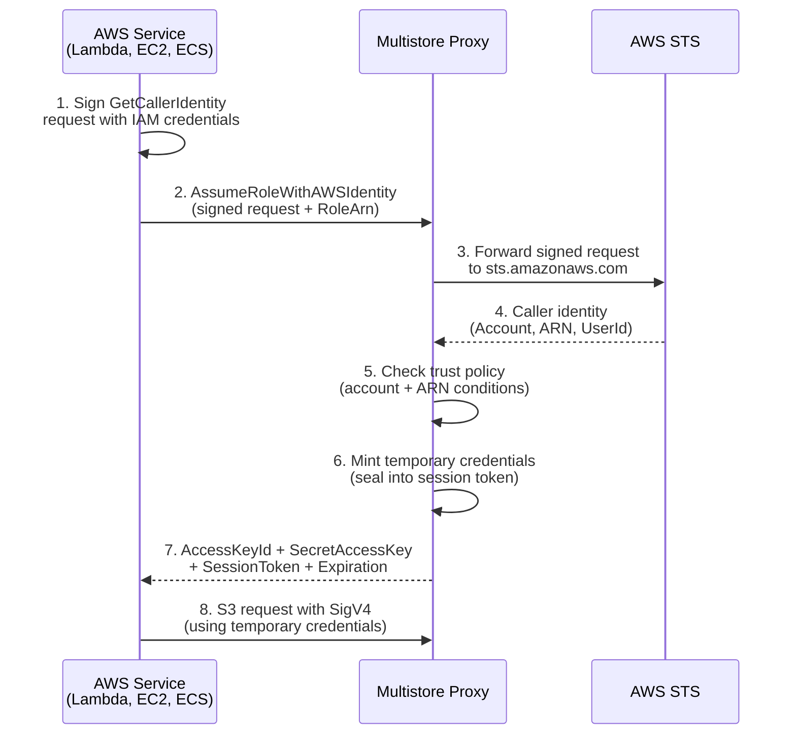

# AWS IAM Identity Verification

This page covers authenticating AWS services with the proxy using their existing IAM credentials, without needing an OIDC provider.

## Overview

AWS services (Lambda, EC2, ECS tasks, etc.) come with IAM credentials automatically via instance profiles, execution roles, or task roles. The `AssumeRoleWithAWSIdentity` action lets these services authenticate with the proxy by proving their IAM identity — no secrets to distribute, no OIDC provider to set up.

This follows the same pattern used by [HashiCorp Vault's AWS auth method](https://developer.hashicorp.com/vault/docs/auth/aws).

## How It Works



### Verification Flow

1. The client creates a signed `GetCallerIdentity` request using its IAM credentials (without sending it to AWS)
2. The client base64-encodes the signed URL, body, and headers and sends them to the proxy as query parameters
3. The proxy validates the STS URL is a real AWS endpoint, then forwards the signed request to AWS STS
4. AWS STS verifies the signature cryptographically and returns the caller's identity
5. The proxy checks the trust policy:
   - **Account**: the caller's AWS account must be in the role's `trusted_aws_accounts`
   - **ARN**: the caller's IAM ARN must match at least one of the role's `subject_conditions` (supports `*` glob wildcards)
6. The proxy mints temporary credentials scoped to the role's `allowed_scopes`
7. The client uses the temporary credentials to sign S3 requests normally

## Role Configuration

```toml
[[roles]]
role_id = "aws-etl-role"
name = "ETL Pipeline"
trusted_aws_accounts = ["123456789012"]
subject_conditions = [
    "arn:aws:sts::123456789012:assumed-role/EtlPipeline*/*",
]
max_session_duration_secs = 3600

[[roles.allowed_scopes]]
bucket = "ml-artifacts"
prefixes = ["models/production/"]
actions = ["get_object", "head_object", "put_object"]
```

> [!NOTE]
> A role can have both `trusted_oidc_issuers` and `trusted_aws_accounts`. This allows the same role to accept both OIDC tokens and AWS IAM identity verification.

### Subject Conditions for AWS ARNs

The `subject_conditions` field matches against the caller's full IAM ARN. Common patterns:

| Pattern | Matches |
|---------|---------|
| `arn:aws:sts::123456789012:assumed-role/MyRole/*` | Any EC2/ECS instance assuming `MyRole` |
| `arn:aws:iam::123456789012:user/deploy-*` | IAM users starting with `deploy-` |
| `arn:aws:sts::123456789012:assumed-role/*/i-*` | Any role assumed by an EC2 instance |
| `arn:aws:sts::*:assumed-role/EtlPipeline/*` | `EtlPipeline` role in any trusted account |

## STS Request Parameters

All parameters are sent as query string parameters:

| Parameter | Required | Description |
|-----------|----------|-------------|
| `Action` | Yes | Must be `AssumeRoleWithAWSIdentity` |
| `RoleArn` | Yes | The `role_id` of the role to assume |
| `IamRequestUrl` | Yes | Base64-encoded STS endpoint URL |
| `IamRequestBody` | Yes | Base64-encoded `GetCallerIdentity` request body |
| `IamRequestHeaders` | Yes | Base64-encoded JSON of the signed HTTP headers |
| `DurationSeconds` | No | Session duration (900s minimum, capped by `max_session_duration_secs`) |

The response format is identical to `AssumeRoleWithWebIdentity`.

## Template Variables

When minting credentials, the following template variables are available in scope definitions:

| Variable | Description | Example |
|----------|-------------|---------|
| `{sub}` | Caller's IAM ARN (same as `{aws_arn}`) | `arn:aws:sts::123456789012:assumed-role/MyRole/i-0abc` |
| `{aws_account}` | AWS account ID | `123456789012` |
| `{aws_arn}` | Full IAM ARN | `arn:aws:sts::123456789012:assumed-role/MyRole/i-0abc` |
| `{aws_user_id}` | AWS unique user ID | `AROAEXAMPLE:i-0abc123` |

Example: per-account bucket isolation:

```toml
[[roles.allowed_scopes]]
bucket = "tenant-{aws_account}"
prefixes = []
actions = ["get_object", "head_object", "put_object", "list_bucket"]
```

## Client Examples

### Python (Lambda / EC2 / ECS)

```python
import boto3
import base64
import json
import requests
from botocore.auth import SigV4Auth
from botocore.awsrequest import AWSRequest

PROXY_URL = "https://proxy.example.com"

def get_proxy_credentials(role_arn="aws-etl-role"):
    """Exchange IAM identity for proxy credentials."""
    # Step 1: Create a signed GetCallerIdentity request
    session = boto3.Session()
    credentials = session.get_credentials().get_frozen_credentials()

    sts_request = AWSRequest(
        method="POST",
        url="https://sts.amazonaws.com/",
        data="Action=GetCallerIdentity&Version=2011-06-15",
        headers={"Content-Type": "application/x-www-form-urlencoded"},
    )
    SigV4Auth(credentials, "sts", "us-east-1").add_auth(sts_request)

    # Step 2: Base64-encode the signed request components
    iam_request_url = base64.b64encode(
        b"https://sts.amazonaws.com/"
    ).decode()
    iam_request_body = base64.b64encode(
        sts_request.data.encode() if isinstance(sts_request.data, str)
        else sts_request.data
    ).decode()
    iam_request_headers = base64.b64encode(
        json.dumps(dict(sts_request.headers)).encode()
    ).decode()

    # Step 3: Call the proxy's STS endpoint
    resp = requests.post(
        PROXY_URL,
        params={
            "Action": "AssumeRoleWithAWSIdentity",
            "RoleArn": role_arn,
            "IamRequestUrl": iam_request_url,
            "IamRequestBody": iam_request_body,
            "IamRequestHeaders": iam_request_headers,
        },
    )
    resp.raise_for_status()

    # Step 4: Parse the STS XML response
    import xml.etree.ElementTree as ET
    root = ET.fromstring(resp.text)
    ns = {"": "https://sts.amazonaws.com/doc/2011-06-15/"}
    creds = root.find(".//Credentials", ns) or root.find(".//Credentials")

    return {
        "AccessKeyId": creds.find("AccessKeyId").text,
        "SecretAccessKey": creds.find("SecretAccessKey").text,
        "SessionToken": creds.find("SessionToken").text,
    }


def handler(event, context):
    creds = get_proxy_credentials()

    s3 = boto3.client(
        "s3",
        endpoint_url=PROXY_URL,
        aws_access_key_id=creds["AccessKeyId"],
        aws_secret_access_key=creds["SecretAccessKey"],
        aws_session_token=creds["SessionToken"],
        region_name="auto",
    )

    s3.download_file(
        "ml-artifacts",
        "models/production/latest.bin",
        "/tmp/model.bin",
    )
```

## Security

### STS URL Validation

The proxy only forwards signed requests to verified AWS STS endpoints (`sts.amazonaws.com` and regional variants). This prevents an attacker from pointing the proxy at a controlled server that returns fake identity claims.

### No Credential Exposure

The proxy never sees the caller's AWS credentials. It only receives a pre-signed request — the SigV4 signature headers. AWS STS performs the actual cryptographic verification.

### Replay Window

A signed `GetCallerIdentity` request is valid until the SigV4 signature expires (~15 minutes). An attacker who intercepts the signed request could replay it within that window. This risk is mitigated by:

- **TLS transport** — the signed request travels over HTTPS
- **Short signature lifetime** — AWS STS rejects stale signatures

> [!NOTE]
> A future enhancement will support `X-Multistore-Server-ID` header binding (similar to Vault's `iam_server_id_header_value`), which prevents a signed request from being replayed against a different proxy instance.

### Comparison with Other Auth Methods

| Property | Long-Lived Keys | OIDC/STS | AWS IAM |
|----------|----------------|----------|---------|
| Secrets to manage | Yes | External IdP | None |
| Identity verification | Bearer token | JWT signature | AWS STS |
| Credential lifetime | Until revoked | Minutes–hours | Minutes–hours |
| AWS setup required | Secrets Manager (optional) | OIDC provider | None (IAM roles exist) |
| Proxy setup required | Per-credential config | Per-role config | Per-role config |
