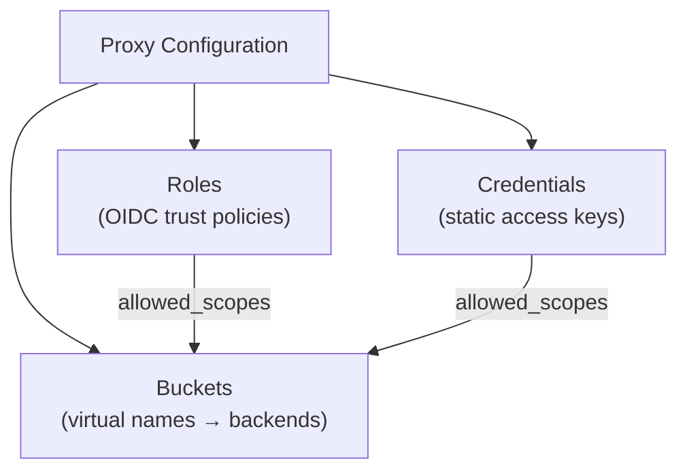

# Configuration

The proxy configuration defines three things:

1. **[Buckets](./buckets)** — Virtual buckets that map client-visible names to backend object stores
2. **[Roles](./roles)** — Trust policies for OIDC token exchange via `AssumeRoleWithWebIdentity`
3. **[Credentials](./credentials)** — Long-lived access keys for service accounts and internal tools



## Config Format

The server runtime uses TOML:

```toml
[[buckets]]
name = "public-data"
backend_type = "s3"
anonymous_access = true

[buckets.backend_options]
endpoint = "https://s3.us-east-1.amazonaws.com"
bucket_name = "my-public-assets"
region = "us-east-1"
```

The CF Workers runtime uses JSON (as an environment variable or `wrangler.toml` object):

```json
{
  "buckets": [{
    "name": "public-data",
    "backend_type": "s3",
    "anonymous_access": true,
    "backend_options": {
      "endpoint": "https://s3.us-east-1.amazonaws.com",
      "bucket_name": "my-public-assets",
      "region": "us-east-1"
    }
  }]
}
```

## Top-Level Keys

Alongside the `buckets`, `roles`, and `credentials` arrays, the static file config accepts two optional top-level keys that control the owner identity reported in `ListBuckets` (`ListAllMyBucketsResult`) responses:

| Key | Type | Required | Description |
|-----|------|----------|-------------|
| `owner_id` | string | No | Owner ID returned in `ListBuckets` responses. Defaults to `multistore-proxy` when omitted. |
| `owner_display_name` | string | No | Owner display name returned in `ListBuckets` responses. Defaults to `multistore-proxy` when omitted. |

```toml
owner_id = "my-org"
owner_display_name = "My Organization"

[[buckets]]
name = "public-data"
# ...
```

## Config Providers

The proxy resolves its configuration through any type implementing the `BucketRegistry`/`CredentialRegistry` traits. See [Config Providers](./providers/) for details.

| Provider | Status | Use Case |
|----------|--------|----------|
| [Static File](./providers/static-file) | Built-in (always available) | Simple deployments, baked-in config |

`StaticProvider` is the only built-in config provider. To source config from elsewhere, implement the registry traits yourself (optionally wrapped with the example [CachedProvider](./providers/cached) for in-memory caching).

## Full Example

See the [annotated config example](/reference/config-example) for a complete configuration file with all options documented.
