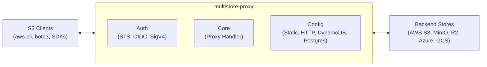

## How It Works

The proxy sits between S3-compatible clients and backend object stores. It authenticates incoming requests, authorizes them against configured scopes, and forwards them to the appropriate backend using presigned URLs for zero-copy streaming.

## Get Started

The [Getting Started](/getting-started/) guide walks you through setting up, configuring, and deploying the proxy — defining backends, buckets, roles, authentication, and extending with custom resolvers and providers.
